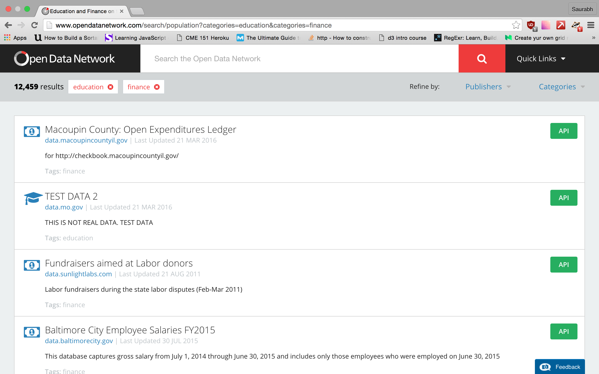
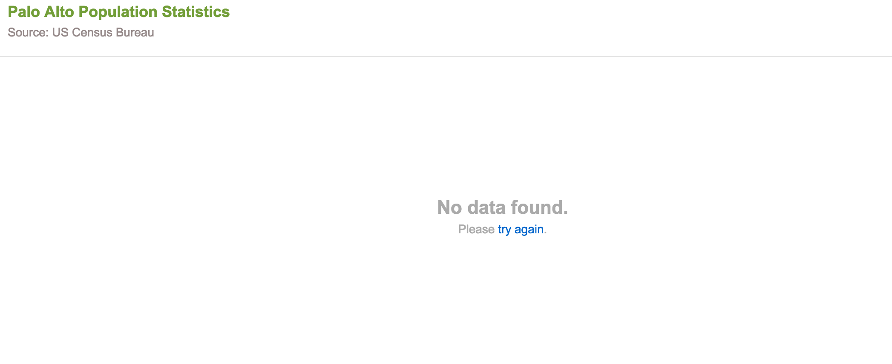

# Thoughts on the 4 data websites

### [Data.gov](http://www.data.gov)
The interface is fairly nice. I straightaway clicked on the local governments tab. I found the [NYC leading cause of deaths](http://catalog.data.gov/dataset/new-york-city-leading-causes-of-death-ce97f) pretty interesting). I like that there is an option to filter by CSV//JSON to see what kind of data is available.

The website seems quite broad in terms of what it offers, so it might be a little difficult to actually locate a dataset when we sit down to find it.

### [Open Data Network](http://www.opendatanetwork.com/)
I instantly dislike its list-like feature. It makes it difficult to discern any organization in the data. 

It seems a lot like looking for a value in a table of hundred rows - you know it is there somewhere, but you don't know how to find it. It also has weird names like [Do Hispanics really fare better?](http://www.opendatanetwork.com/dataset/bchi.bigcitieshealth.org/8mzj-f3pz) for a dataset. 

I do like the city-wise arrangement, though. But once you navigate to a particular city, it becomes a mess - at least for me. I wouldn't use this dataset unless I know that the file is here for sure.

### [Palo Alto Open Data](http://data.cityofpaloalto.org/home)
Landing page is okay. I do like the snapshot view of the data and the tabs that allow switching between topics and categories. It could use the Socrata information page for each dataset that details, most of the times, the characteristics of the data and any limitations it may have.

I would've liked to see a Palo Alto population statistics, but there seems to be none.

### [FEC](http://www.fec.gov/data/DataCatalog.do?format=html)
Well, well, FEC. We meet again. I do not subscribe to their .fec format. That is just ridiculous. It is also super difficult to actually locate the data page if you come from the home page. They have tucked it away in a sidebar somewhere.

As far as the data goes, I have looked at the individual contributions and would've liked to have better categorization on employer (I know it is self-reported). I still don't get the wisdom behind having a [separate header file](http://www.fec.gov/finance/disclosure/ftpdet.shtml).

I happened to attend Derek Willis' NICAR session in which he had pointed out several issues with the campaign committee data. 

### [Data gov Uk](https://data.gov.uk/)
Landing page is quite strange. Nonetheless I went to the datasets. They have something called Unpublished datasets, which I am curious to know what it means.

But there seem to helpful datasets like the [Social trends report](https://data.gov.uk/dataset/social_trends). I prefer the Socrata layout since it is organized better visually and makes it easier to find datasets.